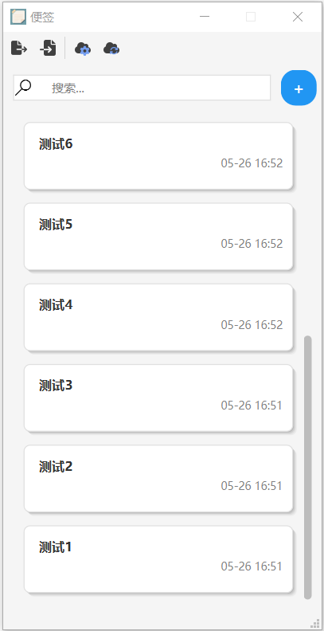
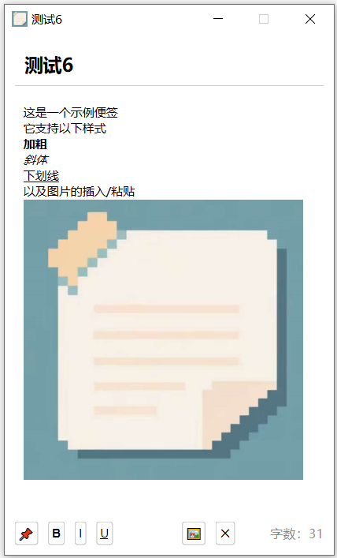

# SimpleNote - 简单便签应用程序

<div align="center">
  
</div>

SimpleNote是一个基于Qt开发的轻量级便签应用程序，提供简洁易用的界面和强大的文本编辑功能。

## 功能特性

- 创建、编辑、保存和删除便签
- 支持富文本格式（粗体、斜体、下划线）
- 支持图片插入和查看
- 便签列表显示，包含标题和更新时间
- 便签内容自动保存
- 便签窗口置顶功能
- 便签搜索功能
- 支持独立编辑窗口

## 界面展示

### 便签列表

便签列表采用卡片式设计，显示便签标题和更新时间，支持便签搜索功能。

<div align="center">
  
  <p><i>便签列表界面</i></p>
</div>

### 便签编辑器

编辑界面支持富文本编辑，包括文本格式设置和图片插入功能。

<div align="center">
  
  <p><i>便签编辑界面</i></p>
</div>

### 图片查看

支持点击查看插入的图片，并可调整图片大小。

<div align="center">
  
  <p><i>图片查看功能</i></p>
</div>

## 技术架构

### 核心组件

1. **MainWindow** - 主窗口类，负责程序启动和界面初始化
2. **NoteListWidget** - 便签列表组件，显示所有便签并支持搜索
3. **NoteEditWidget** - 便签编辑组件，支持富文本编辑和图片插入
4. **NoteDatabase** - 数据库操作类，处理便签的存储和检索
5. **Note** - 便签数据模型，定义便签的基本结构

### 数据存储

- 使用SQLite数据库存储便签数据
- 图片文件存储在本地文件系统

## 项目结构

```
SimpleNote/
├── main.cpp              # 程序入口
├── SimpleNote.pro        # Qt项目文件
├── SimpleNote.rc         # Windows资源文件
├── resources.qrc         # Qt资源文件
├── mainwindow.h/cpp      # 主窗口实现
├── notelistwidget.h/cpp  # 便签列表组件
├── noteeditwidget.h/cpp  # 便签编辑组件
├── notedatabase.h/cpp    # 数据库操作类
├── note.h/cpp            # 便签数据模型
├── mainwindow.ui         # 主窗口UI设计
├── notelistwidget.ui     # 便签列表UI设计
├── noteeditwidget.ui     # 便签编辑器UI设计
├── icons/                # 应用图标资源
│   ├── simplenote.ico    # Windows图标
│   └── simplenote.png    # 通用图标
├── imgs/                 # 文档图片资源
│   ├── editor.png        # 编辑器界面示例
│   ├── list.png          # 列表界面示例
│   └── picture.png       # 图片查看示例
└── .github/              # GitHub相关配置
    └── workflows/        # GitHub Actions工作流
        └── release.yml   # 自动构建与发布配置
```

## 界面设计

- 主窗口采用简洁的卡片式设计
- 便签列表使用自定义代理绘制美观的便签卡片
- 编辑窗口支持富文本编辑和图片展示
- 统一的视觉风格和交互体验

## 编译与运行

### 环境要求

- Qt 5.15或更高版本
- 支持C++17的编译器
- Qt SQL模块支持

### 编译步骤

1. 使用Qt Creator打开SimpleNote.pro文件
2. 配置编译环境
3. 点击构建按钮编译项目
4. 运行应用程序

### 自动构建与发布

本项目配置了GitHub Actions自动构建与发布功能，当推送带有`v`前缀的标签（如`v1.0.0`）时，会自动构建Windows和Ubuntu版本并创建Release。

详细说明请参考[GitHub Action自动发布说明](docs/github-action-usage.md)。

## 功能使用说明

### 创建新便签

点击便签列表顶部的"+"按钮创建新便签。

### 编辑便签

点击便签列表中的任意便签打开编辑窗口，可以编辑标题和内容。便签内容支持富文本格式，可以使用工具栏按钮设置文本格式。

### 插入图片

可以通过复制图片并在编辑器中粘贴来插入图片。点击图片可以查看原始大小。

### 便签置顶

在编辑窗口右上角点击置顶按钮，可以使便签窗口始终保持在其他窗口之上。

### 搜索便签

在便签列表顶部的搜索框中输入关键词，可以快速查找包含该关键词的便签。